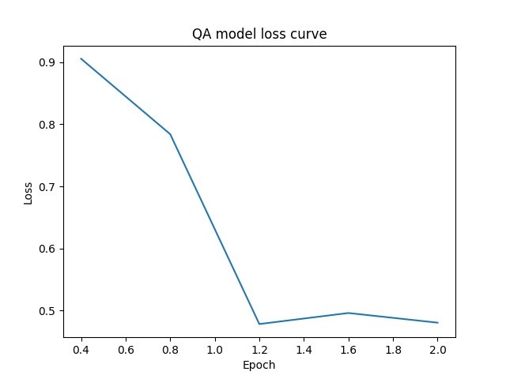
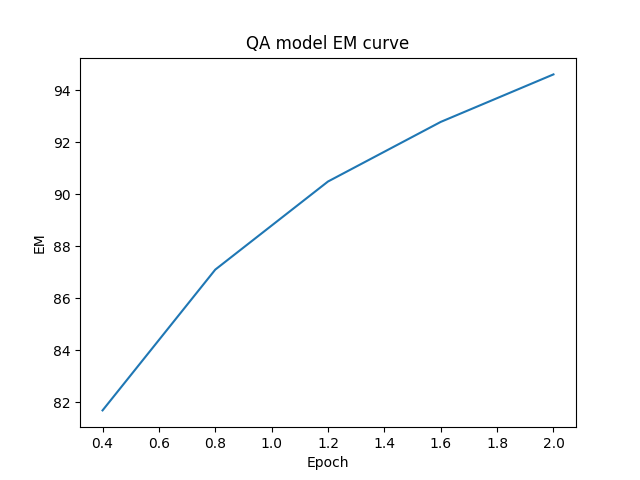

# ADL HW2 Report
editer: M11015Q02 柯元豪
## Q1 (Data processing)
### Tokenizer
#### Multiple Choice
在前處理時，會將 question 與 4 個候選的 context 同時做 tokenize，tokenizer 會根據 max_seq_length 將原始句子做斷詞、編碼，其中 tokenizer 加入的 special token 也可能隨著選用的 pretrained model 不同而有所改變，最終會處理成 [(tokenized_question, $tokenized context_{1}$),...,(tokenized_question, $tokenized context_{4}$)] 的集合
#### Question Answering
在前處理時，為了避免 question 中有過多空白字元，會先將其移除；接著將處理後的 question 與 context 交給 tokenizer 處理。
Tokenizer 會根據 max_seq_length 做 truncation & padding，透過 overflow_to_sample_mapping 能夠將得到的 sequence feature mapping 回去 sequence，透過 offset_mapping 能夠幫助我們 mapping token 所對應到原句子中的 position。

### Answer Span
#### How did you convert the answer span start/end position on characters to position on tokens after BERT tokenization?
Answer Span 階段會將 tokenized 後的 tokenized_examples 逐筆做處理。
先取出 input_ids 以此可以得到 CLS_token 所在的 postion，也能得到 tokenized sequence length 以利後續尋找 end postion。
接著先確認此筆 tokenized_example 有沒有給定 answer start 的位置，如果沒有則將 start/end position 都設為 CLS_token 的位置，如果有則將 start postion 設為給定的位置，而 end position 則為 start postion + anwser length，後續再將目前的 start/end position 透過 offset_mapping mapping 回去原句子中的 position。

#### After your model predicts the probability of answer span start/end position, what rules did you apply to determine the final start/end position?
在 post_processing_function 的步驟，會將模型輸出的 (start_logits, end_logits) 組合，排除所有 start/end position 可能發生的不合理情況，如 end position 比 start postion 前面、start position 超過 sequence length ...等，最後排序剩餘組合的分數，取 N 個最高分的 start/end position 儲存在 nbest_predictions.json，最佳的也會直接 mapping 回原句，將答案儲存在 predictions.json。

<div STYLE="page-break-after: always;"></div>

## Q2 (Modeling with BERTs and their variants)
### Describe
- configuration of the transformer model
    #### Multiple Choice
    ```=json
    {
      "_name_or_path": "bert-base-chinese",
      "architectures": [
        "BertForMultipleChoice"
      ],
      "attention_probs_dropout_prob": 0.1,
      "classifier_dropout": null,
      "directionality": "bidi",
      "hidden_act": "gelu",
      "hidden_dropout_prob": 0.1,
      "hidden_size": 768,
      "initializer_range": 0.02,
      "intermediate_size": 3072,
      "layer_norm_eps": 1e-12,
      "max_position_embeddings": 512,
      "model_type": "bert",
      "num_attention_heads": 12,
      "num_hidden_layers": 12,
      "pad_token_id": 0,
      "pooler_fc_size": 768,
      "pooler_num_attention_heads": 12,
      "pooler_num_fc_layers": 3,
      "pooler_size_per_head": 128,
      "pooler_type": "first_token_transform",
      "position_embedding_type": "absolute",
      "torch_dtype": "float32",
      "transformers_version": "4.17.0",
      "type_vocab_size": 2,
      "use_cache": true,
      "vocab_size": 21128
    }
    ```
    #### Question Answering
    ```=json
    {
      "_name_or_path": "bert-base-chinese",
      "architectures": [
        "BertForQuestionAnswering"
      ],
      "attention_probs_dropout_prob": 0.1,
      "classifier_dropout": null,
      "directionality": "bidi",
      "hidden_act": "gelu",
      "hidden_dropout_prob": 0.1,
      "hidden_size": 768,
      "initializer_range": 0.02,
      "intermediate_size": 3072,
      "layer_norm_eps": 1e-12,
      "max_position_embeddings": 512,
      "model_type": "bert",
      "num_attention_heads": 12,
      "num_hidden_layers": 12,
      "pad_token_id": 0,
      "pooler_fc_size": 768,
      "pooler_num_attention_heads": 12,
      "pooler_num_fc_layers": 3,
      "pooler_size_per_head": 128,
      "pooler_type": "first_token_transform",
      "position_embedding_type": "absolute",
      "torch_dtype": "float32",
      "transformers_version": "4.17.0",
      "type_vocab_size": 2,
      "use_cache": true,
      "vocab_size": 21128
    }
    ```
- performance
    #### Multiple Choice
    ```=json
    # Validation Set
    Accuracy: 0.9937
    ```
    #### Question Answering
    ```=json
    # Test Set
    EM: 0.7749 (Kaggle) 

    # Validation Set
    EM: 0.9351
    ```

<div STYLE="page-break-after: always;"></div>

- loss function
    #### Multiple Choice
    ```
    CrossEntropyLoss
    ```
    #### Question Answering
    ```
    CrossEntropyLoss
    ```
- The following hyperparameters were used during training:
    #### Multiple Choice
    ```
    learning_rate: 3e-05
    train_batch_size: 1
    eval_batch_size: 8
    seed: 42
    gradient_accumulation_steps: 2
    total_train_batch_size: 2
    optimizer: Adam with betas=(0.9,0.999) and epsilon=1e-08
    lr_scheduler_type: linear
    num_epochs: 2.0
    ```
    #### Question Answering
    ```
    learning_rate: 3e-05
    train_batch_size: 4
    eval_batch_size: 8
    seed: 42
    gradient_accumulation_steps: 2
    total_train_batch_size: 8
    optimizer: Adam with betas=(0.9,0.999) and epsilon=1e-08
    lr_scheduler_type: linear
    num_epochs: 2.0
    ```
<div STYLE="page-break-after: always;"></div>

### Try another type of pretrained model and describe
#### Question Answering (Use the same Multiple Choice model)
- configuration of the transformer model
    ```=json
    {
      "_name_or_path": "hfl/chinese-roberta-wwm-ext",
      "architectures": [
        "BertForQuestionAnswering"
      ],
      "attention_probs_dropout_prob": 0.1,
      "bos_token_id": 0,
      "classifier_dropout": null,
      "directionality": "bidi",
      "eos_token_id": 2,
      "hidden_act": "gelu",
      "hidden_dropout_prob": 0.1,
      "hidden_size": 768,
      "initializer_range": 0.02,
      "intermediate_size": 3072,
      "layer_norm_eps": 1e-12,
      "max_position_embeddings": 512,
      "model_type": "bert",
      "num_attention_heads": 12,
      "num_hidden_layers": 12,
      "output_past": true,
      "pad_token_id": 0,
      "pooler_fc_size": 768,
      "pooler_num_attention_heads": 12,
      "pooler_num_fc_layers": 3,
      "pooler_size_per_head": 128,
      "pooler_type": "first_token_transform",
      "position_embedding_type": "absolute",
      "torch_dtype": "float32",
      "transformers_version": "4.17.0",
      "type_vocab_size": 2,
      "use_cache": true,
      "vocab_size": 21128
    }
    ```
- performance
    ```=python
    # Test Set
    EM: 0.7966 (Kaggle) 

    # Validation Set
    EM: 0.9461
    ```
- difference
    #### architecture
    |                   | bert-base-chinese | chinese-roberta-wwm-ext |
    |:----------------- |:-----------------:|:-----------------------:|
    | Masking           |     WordPiece     |       WWM$^{[1]}$       |
    | Type              |       base        |          base           |
    | Data Source       |       wiki        |    wiki+ext$^{[2]}$     |
    | Training Tokens # |       0.4B        |          5.4B           |
    | Device            |    TPU Pod v2     |         TPU v3          |
    | Optimizer         |       AdamW       |          AdamW          |
    | Vocabulary        |      21,128       |   ~bert-base-chinese    |
    | Init Checkpoint   |    Random Init    |   ~bert-base-chinese    |
    
    [1] WWM: Whole Word Masking
    [2] ext: extended data
    
    RoBERTa 與 BERT 不同在於，RoBERTa 取消了 BERT 原有的 Next SentencePrediction(NSP) 任務，並將原本靜態 Masking 的方法改成動態的 Masking。
    #### pretraining loss
    ```=json
    # bert-base-chinese
    "train_loss": 0.7986815468019802
    # chinese-roberta-wwm-ext
    "train_loss": 0.7193350367217894
    ```
<div STYLE="page-break-after: always;"></div>

## Q3 (Curves)
### Learning curve of loss


### Learning curve of EM


<div STYLE="page-break-after: always;"></div>

## Q4 (Pretrained vs Not Pretrained)
### Configuration of the model and how do you train this model
- config
    ```=json
    {
      "_name_or_path": "tmp/qa_chinese_roberta_wwm_ext/",
      "architectures": [
        "BertForQuestionAnswering"
      ],
      "attention_probs_dropout_prob": 0.1,
      "bos_token_id": 0,
      "classifier_dropout": null,
      "directionality": "bidi",
      "eos_token_id": 2,
      "hidden_act": "gelu",
      "hidden_dropout_prob": 0.1,
      "hidden_size": 768,
      "initializer_range": 0.02,
      "intermediate_size": 3072,
      "layer_norm_eps": 1e-12,
      "max_position_embeddings": 512,
      "model_type": "bert",
      "num_attention_heads": 12,
      "num_hidden_layers": 12,
      "output_past": true,
      "pad_token_id": 0,
      "pooler_fc_size": 768,
      "pooler_num_attention_heads": 12,
      "pooler_num_fc_layers": 3,
      "pooler_size_per_head": 128,
      "pooler_type": "first_token_transform",
      "position_embedding_type": "absolute",
      "torch_dtype": "float32",
      "transformers_version": "4.17.0",
      "type_vocab_size": 2,
      "use_cache": true,
      "vocab_size": 21128
    }
    ```
<div STYLE="page-break-after: always;"></div>

- how to train
    ```
    將 
        model = AutoModelForQuestionAnswering.from_pretrained()
    替換成:
        config = AutoConfig.from_pretrained(model_config_path)
        model = AutoModelForQuestionAnswering.from_config(config)
    
    從相同模型設定的資料夾讀取 config，AutoModel 中的 from_pretrained 會 load weight，
    而 from_config 則不會，其餘的 training script 不變，即可 training from scratch
    ```
### Performance of this model v.s. BERT
```=json
# Evaluate on valid set

(Without pretrained weight)
{
    "eval_exact_match": 6.945829179129279,
    "eval_f1": 6.945829179129279,
}

(With pretrained weight)
{
    "eval_exact_match": 94.6161515453639,
    "eval_f1": 94.6161515453639,
}
```
<div STYLE="page-break-after: always;"></div>

## Q5 (Bonus: HW1 with BERTs)
### model
#### intent
```=json
{
  "_name_or_path": "bert-base-cased",
  "architectures": [
    "BertForSequenceClassification"
  ],
  "attention_probs_dropout_prob": 0.1,
  "classifier_dropout": null,
  "gradient_checkpointing": false,
  "hidden_act": "gelu",
  "hidden_dropout_prob": 0.1,
  "hidden_size": 768,
  "id2label": {
    "0": "accept_reservations",
    "1": "account_blocked",
    "2": "alarm",
    .
    {太冗長，故省略}
    .
    "147": "who_do_you_work_for",
    "148": "who_made_you",
    "149": "yes"
  },
  "initializer_range": 0.02,
  "intermediate_size": 3072,
  "label2id": {
    "accept_reservations": 0,
    "account_blocked": 1,
    "alarm": 2,
    .
    {太冗長，故省略}
    .
    "who_do_you_work_for": 147,
    "who_made_you": 148,
    "yes": 149
  },
  "layer_norm_eps": 1e-12,
  "max_position_embeddings": 512,
  "model_type": "bert",
  "num_attention_heads": 12,
  "num_hidden_layers": 12,
  "pad_token_id": 0,
  "position_embedding_type": "absolute",
  "problem_type": "single_label_classification",
  "torch_dtype": "float32",
  "transformers_version": "4.17.0",
  "type_vocab_size": 2,
  "use_cache": true,
  "vocab_size": 28996
}

```
#### slot tagging
```=json
{
  "_name_or_path": "bert-base-cased",
  "architectures": [
    "BertForTokenClassification"
  ],
  "attention_probs_dropout_prob": 0.1,
  "classifier_dropout": null,
  "finetuning_task": "ner",
  "gradient_checkpointing": false,
  "hidden_act": "gelu",
  "hidden_dropout_prob": 0.1,
  "hidden_size": 768,
  "id2label": {
    "0": "B-date",
    "1": "B-first_name",
    "2": "B-last_name",
    "3": "B-people",
    "4": "B-time",
    "5": "I-date",
    "6": "I-people",
    "7": "I-time",
    "8": "O"
  },
  "initializer_range": 0.02,
  "intermediate_size": 3072,
  "label2id": {
    "B-date": 0,
    "B-first_name": 1,
    "B-last_name": 2,
    "B-people": 3,
    "B-time": 4,
    "I-date": 5,
    "I-people": 6,
    "I-time": 7,
    "O": 8
  },
  "layer_norm_eps": 1e-12,
  "max_position_embeddings": 512,
  "model_type": "bert",
  "num_attention_heads": 12,
  "num_hidden_layers": 12,
  "pad_token_id": 0,
  "position_embedding_type": "absolute",
  "torch_dtype": "float32",
  "transformers_version": "4.17.0",
  "type_vocab_size": 2,
  "use_cache": true,
  "vocab_size": 28996
}

```
### performance
#### intent classification

#### slot tagging


### Loss function
#### intent classification & slot tagging
```
CrossEntropyLoss
```

### The optimization algorithm (e.g. Adam), learning rate and batch size.
#### intent classification & slot tagging
```
learning_rate: 5e-05
train_batch_size: 8
eval_batch_size: 8
seed: 42
optimizer: Adam with betas=(0.9,0.999) and epsilon=1e-08
lr_scheduler_type: linear
num_epochs: 3.0
```